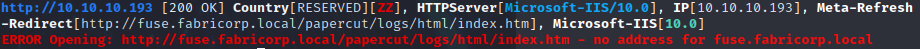

# :electric_plug: Fuse :cloud_with_lightning:

### Initial Scans

**<u>Quick:</u>**

```bash
PORT    STATE SERVICE      VERSION
53/tcp  open  domain       Simple DNS Plus
80/tcp  open  http         Microsoft IIS httpd 10.0
| http-methods: 
|_  Potentially risky methods: TRACE
|_http-server-header: Microsoft-IIS/10.0
|_http-title: Site doesn't have a title (text/html).
88/tcp  open  kerberos-sec Microsoft Windows Kerberos (server time: 2021-02-26 17:34:14Z)
135/tcp open  msrpc        Microsoft Windows RPC
139/tcp open  netbios-ssn  Microsoft Windows netbios-ssn
389/tcp open  ldap         Microsoft Windows Active Directory LDAP (Domain: fabricorp.local, Site: Default-First-Site-Name)
445/tcp open  microsoft-ds Windows Server 2016 Standard 14393 microsoft-ds (workgroup: FABRICORP)
Service Info: Host: FUSE; OS: Windows; CPE: cpe:/o:microsoft:windows
```

**<u>Deep:</u>**

```bash
PORT      STATE SERVICE      VERSION
53/tcp    open  domain?
80/tcp    open  http         Microsoft IIS httpd 10.0
|_http-comments-displayer: Couldn't find any comments.
|_http-date: Fri, 26 Feb 2021 17:37:28 GMT; +25m59s from local time.
|_http-fetch: Please enter the complete path of the directory to save data in.
| http-headers: 
|   Content-Length: 103
|   Content-Type: text/html
|   Last-Modified: Sat, 30 May 2020 00:01:51 GMT
|   Accept-Ranges: bytes
|   ETag: "2c834e851536d61:0"
|   Server: Microsoft-IIS/10.0
|   Date: Fri, 26 Feb 2021 17:37:27 GMT
|   Connection: close
|   
|_  (Request type: HEAD)
| http-methods: 
|_  Potentially risky methods: TRACE
|_http-mobileversion-checker: No mobile version detected.
|_http-referer-checker: Couldn't find any cross-domain scripts.
|_http-security-headers: 
|_http-server-header: Microsoft-IIS/10.0
|_http-title: Site doesn't have a title (text/html).
| http-useragent-tester: 
|   Status for browser useragent: 200
|   Allowed User Agents: 
|     Mozilla/5.0 (compatible; Nmap Scripting Engine; https://nmap.org/book/nse.html)
|     libwww
|     lwp-trivial
|     libcurl-agent/1.0
|     PHP/
|     Python-urllib/2.5
|     GT::WWW
|     Snoopy
|     MFC_Tear_Sample
|     HTTP::Lite
|     PHPCrawl
|     URI::Fetch
|     Zend_Http_Client
|     http client
|     PECL::HTTP
|     Wget/1.13.4 (linux-gnu)
|_    WWW-Mechanize/1.34
|_http-xssed: No previously reported XSS vuln.
88/tcp    open  kerberos-sec Microsoft Windows Kerberos (server time: 2021-02-26 17:35:13Z)
135/tcp   open  msrpc        Microsoft Windows RPC
139/tcp   open  netbios-ssn  Microsoft Windows netbios-ssn
|_smb-enum-services: ERROR: Script execution failed (use -d to debug)
389/tcp   open  ldap         Microsoft Windows Active Directory LDAP (Domain: fabricorp.local, Site: Default-First-Site-Name)
| ldap-rootdse: 
| LDAP Results
|   <ROOT>
|       currentTime: 20210226173730.0Z
|       subschemaSubentry: CN=Aggregate,CN=Schema,CN=Configuration,DC=fabricorp,DC=local
|       dsServiceName: CN=NTDS Settings,CN=FUSE,CN=Servers,CN=Default-First-Site-Name,CN=Sites,CN=Configuration,DC=fabricorp,DC=local
|       namingContexts: DC=fabricorp,DC=local
|       namingContexts: CN=Configuration,DC=fabricorp,DC=local
|       namingContexts: CN=Schema,CN=Configuration,DC=fabricorp,DC=local
|       namingContexts: DC=DomainDnsZones,DC=fabricorp,DC=local
|       namingContexts: DC=ForestDnsZones,DC=fabricorp,DC=local
|       defaultNamingContext: DC=fabricorp,DC=local
|       schemaNamingContext: CN=Schema,CN=Configuration,DC=fabricorp,DC=local
|       configurationNamingContext: CN=Configuration,DC=fabricorp,DC=local
|       rootDomainNamingContext: DC=fabricorp,DC=local
|       supportedControl: 1.2.840.113556.1.4.319
|       supportedControl: 1.2.840.113556.1.4.801
|       supportedControl: 1.2.840.113556.1.4.473
|       supportedControl: 1.2.840.113556.1.4.528
|       supportedControl: 1.2.840.113556.1.4.417
|       supportedControl: 1.2.840.113556.1.4.619
|       supportedControl: 1.2.840.113556.1.4.841
|       supportedControl: 1.2.840.113556.1.4.529
|       supportedControl: 1.2.840.113556.1.4.805
|       supportedControl: 1.2.840.113556.1.4.521
|       supportedControl: 1.2.840.113556.1.4.970
|       supportedControl: 1.2.840.113556.1.4.1338
|       supportedControl: 1.2.840.113556.1.4.474
|       supportedControl: 1.2.840.113556.1.4.1339
|       supportedControl: 1.2.840.113556.1.4.1340
|       supportedControl: 1.2.840.113556.1.4.1413
|       supportedControl: 2.16.840.1.113730.3.4.9
|       supportedControl: 2.16.840.1.113730.3.4.10
|       supportedControl: 1.2.840.113556.1.4.1504
|       supportedControl: 1.2.840.113556.1.4.1852
|       supportedControl: 1.2.840.113556.1.4.802
|       supportedControl: 1.2.840.113556.1.4.1907
|       supportedControl: 1.2.840.113556.1.4.1948
|       supportedControl: 1.2.840.113556.1.4.1974
|       supportedControl: 1.2.840.113556.1.4.1341
|       supportedControl: 1.2.840.113556.1.4.2026
|       supportedControl: 1.2.840.113556.1.4.2064
|       supportedControl: 1.2.840.113556.1.4.2065
|       supportedControl: 1.2.840.113556.1.4.2066
|       supportedControl: 1.2.840.113556.1.4.2090
|       supportedControl: 1.2.840.113556.1.4.2205
|       supportedControl: 1.2.840.113556.1.4.2204
|       supportedControl: 1.2.840.113556.1.4.2206
|       supportedControl: 1.2.840.113556.1.4.2211
|       supportedControl: 1.2.840.113556.1.4.2239
|       supportedControl: 1.2.840.113556.1.4.2255
|       supportedControl: 1.2.840.113556.1.4.2256
|       supportedControl: 1.2.840.113556.1.4.2309
|       supportedLDAPVersion: 3
|       supportedLDAPVersion: 2
|       supportedLDAPPolicies: MaxPoolThreads
|       supportedLDAPPolicies: MaxPercentDirSyncRequests
|       supportedLDAPPolicies: MaxDatagramRecv
|       supportedLDAPPolicies: MaxReceiveBuffer
|       supportedLDAPPolicies: InitRecvTimeout
|       supportedLDAPPolicies: MaxConnections
|       supportedLDAPPolicies: MaxConnIdleTime
|       supportedLDAPPolicies: MaxPageSize
|       supportedLDAPPolicies: MaxBatchReturnMessages
|       supportedLDAPPolicies: MaxQueryDuration
|       supportedLDAPPolicies: MaxDirSyncDuration
|       supportedLDAPPolicies: MaxTempTableSize
|       supportedLDAPPolicies: MaxResultSetSize
|       supportedLDAPPolicies: MinResultSets
|       supportedLDAPPolicies: MaxResultSetsPerConn
|       supportedLDAPPolicies: MaxNotificationPerConn
|       supportedLDAPPolicies: MaxValRange
|       supportedLDAPPolicies: MaxValRangeTransitive
|       supportedLDAPPolicies: ThreadMemoryLimit
|       supportedLDAPPolicies: SystemMemoryLimitPercent
|       highestCommittedUSN: 165250
|       supportedSASLMechanisms: GSSAPI
|       supportedSASLMechanisms: GSS-SPNEGO
|       supportedSASLMechanisms: EXTERNAL
|       supportedSASLMechanisms: DIGEST-MD5
|       dnsHostName: Fuse.fabricorp.local
|       ldapServiceName: fabricorp.local:fuse$@FABRICORP.LOCAL
|       serverName: CN=FUSE,CN=Servers,CN=Default-First-Site-Name,CN=Sites,CN=Configuration,DC=fabricorp,DC=local
|       supportedCapabilities: 1.2.840.113556.1.4.800
|       supportedCapabilities: 1.2.840.113556.1.4.1670
|       supportedCapabilities: 1.2.840.113556.1.4.1791
|       supportedCapabilities: 1.2.840.113556.1.4.1935
|       supportedCapabilities: 1.2.840.113556.1.4.2080
|       supportedCapabilities: 1.2.840.113556.1.4.2237
|       isSynchronized: TRUE
|       isGlobalCatalogReady: TRUE
|       domainFunctionality: 7
|       forestFunctionality: 7
|_      domainControllerFunctionality: 7
445/tcp   open  microsoft-ds Windows Server 2016 Standard 14393 microsoft-ds (workgroup: FABRICORP)
|_smb-enum-services: ERROR: Script execution failed (use -d to debug)
464/tcp   open  kpasswd5?
593/tcp   open  ncacn_http   Microsoft Windows RPC over HTTP 1.0
|_banner: ncacn_http/1.0
636/tcp   open  tcpwrapped
|_unusual-port: tcpwrapped unexpected on port tcp/636
3268/tcp  open  ldap         Microsoft Windows Active Directory LDAP (Domain: fabricorp.local, Site: Default-First-Site-Name)
| ldap-rootdse: 
| LDAP Results
|   <ROOT>
|       currentTime: 20210226173729.0Z
|       subschemaSubentry: CN=Aggregate,CN=Schema,CN=Configuration,DC=fabricorp,DC=local
|       dsServiceName: CN=NTDS Settings,CN=FUSE,CN=Servers,CN=Default-First-Site-Name,CN=Sites,CN=Configuration,DC=fabricorp,DC=local
|       namingContexts: DC=fabricorp,DC=local
|       namingContexts: CN=Configuration,DC=fabricorp,DC=local
|       namingContexts: CN=Schema,CN=Configuration,DC=fabricorp,DC=local
|       namingContexts: DC=DomainDnsZones,DC=fabricorp,DC=local
|       namingContexts: DC=ForestDnsZones,DC=fabricorp,DC=local
|       defaultNamingContext: DC=fabricorp,DC=local
|       schemaNamingContext: CN=Schema,CN=Configuration,DC=fabricorp,DC=local
|       configurationNamingContext: CN=Configuration,DC=fabricorp,DC=local
|       rootDomainNamingContext: DC=fabricorp,DC=local
|       supportedControl: 1.2.840.113556.1.4.319
|       supportedControl: 1.2.840.113556.1.4.801
|       supportedControl: 1.2.840.113556.1.4.473
|       supportedControl: 1.2.840.113556.1.4.528
|       supportedControl: 1.2.840.113556.1.4.417
|       supportedControl: 1.2.840.113556.1.4.619
|       supportedControl: 1.2.840.113556.1.4.841
|       supportedControl: 1.2.840.113556.1.4.529
|       supportedControl: 1.2.840.113556.1.4.805
|       supportedControl: 1.2.840.113556.1.4.521
|       supportedControl: 1.2.840.113556.1.4.970
|       supportedControl: 1.2.840.113556.1.4.1338
|       supportedControl: 1.2.840.113556.1.4.474
|       supportedControl: 1.2.840.113556.1.4.1339
|       supportedControl: 1.2.840.113556.1.4.1340
|       supportedControl: 1.2.840.113556.1.4.1413
|       supportedControl: 2.16.840.1.113730.3.4.9
|       supportedControl: 2.16.840.1.113730.3.4.10
|       supportedControl: 1.2.840.113556.1.4.1504
|       supportedControl: 1.2.840.113556.1.4.1852
|       supportedControl: 1.2.840.113556.1.4.802
|       supportedControl: 1.2.840.113556.1.4.1907
|       supportedControl: 1.2.840.113556.1.4.1948
|       supportedControl: 1.2.840.113556.1.4.1974
|       supportedControl: 1.2.840.113556.1.4.1341
|       supportedControl: 1.2.840.113556.1.4.2026
|       supportedControl: 1.2.840.113556.1.4.2064
|       supportedControl: 1.2.840.113556.1.4.2065
|       supportedControl: 1.2.840.113556.1.4.2066
|       supportedControl: 1.2.840.113556.1.4.2090
|       supportedControl: 1.2.840.113556.1.4.2205
|       supportedControl: 1.2.840.113556.1.4.2204
|       supportedControl: 1.2.840.113556.1.4.2206
|       supportedControl: 1.2.840.113556.1.4.2211
|       supportedControl: 1.2.840.113556.1.4.2239
|       supportedControl: 1.2.840.113556.1.4.2255
|       supportedControl: 1.2.840.113556.1.4.2256
|       supportedControl: 1.2.840.113556.1.4.2309
|       supportedLDAPVersion: 3
|       supportedLDAPVersion: 2
|       supportedLDAPPolicies: MaxPoolThreads
|       supportedLDAPPolicies: MaxPercentDirSyncRequests
|       supportedLDAPPolicies: MaxDatagramRecv
|       supportedLDAPPolicies: MaxReceiveBuffer
|       supportedLDAPPolicies: InitRecvTimeout
|       supportedLDAPPolicies: MaxConnections
|       supportedLDAPPolicies: MaxConnIdleTime
|       supportedLDAPPolicies: MaxPageSize
|       supportedLDAPPolicies: MaxBatchReturnMessages
|       supportedLDAPPolicies: MaxQueryDuration
|       supportedLDAPPolicies: MaxDirSyncDuration
|       supportedLDAPPolicies: MaxTempTableSize
|       supportedLDAPPolicies: MaxResultSetSize
|       supportedLDAPPolicies: MinResultSets
|       supportedLDAPPolicies: MaxResultSetsPerConn
|       supportedLDAPPolicies: MaxNotificationPerConn
|       supportedLDAPPolicies: MaxValRange
|       supportedLDAPPolicies: MaxValRangeTransitive
|       supportedLDAPPolicies: ThreadMemoryLimit
|       supportedLDAPPolicies: SystemMemoryLimitPercent
|       highestCommittedUSN: 165250
|       supportedSASLMechanisms: GSSAPI
|       supportedSASLMechanisms: GSS-SPNEGO
|       supportedSASLMechanisms: EXTERNAL
|       supportedSASLMechanisms: DIGEST-MD5
|       dnsHostName: Fuse.fabricorp.local
|       ldapServiceName: fabricorp.local:fuse$@FABRICORP.LOCAL
|       serverName: CN=FUSE,CN=Servers,CN=Default-First-Site-Name,CN=Sites,CN=Configuration,DC=fabricorp,DC=local
|       supportedCapabilities: 1.2.840.113556.1.4.800
|       supportedCapabilities: 1.2.840.113556.1.4.1670
|       supportedCapabilities: 1.2.840.113556.1.4.1791
|       supportedCapabilities: 1.2.840.113556.1.4.1935
|       supportedCapabilities: 1.2.840.113556.1.4.2080
|       supportedCapabilities: 1.2.840.113556.1.4.2237
|       isSynchronized: TRUE
|       isGlobalCatalogReady: TRUE
|       domainFunctionality: 7
|       forestFunctionality: 7
|_      domainControllerFunctionality: 7
3269/tcp  open  tcpwrapped
|_unusual-port: tcpwrapped unexpected on port tcp/3269
5985/tcp  open  http         Microsoft HTTPAPI httpd 2.0 (SSDP/UPnP)
|_http-comments-displayer: Couldn't find any comments.
|_http-date: Fri, 26 Feb 2021 17:37:30 GMT; +26m00s from local time.
|_http-fetch: Please enter the complete path of the directory to save data in.
| http-headers: 
|   Content-Type: text/html; charset=us-ascii
|   Server: Microsoft-HTTPAPI/2.0
|   Date: Fri, 26 Feb 2021 17:37:30 GMT
|   Connection: close
|   Content-Length: 315
|   
|_  (Request type: GET)
|_http-mobileversion-checker: No mobile version detected.
|_http-referer-checker: Couldn't find any cross-domain scripts.
|_http-security-headers: 
|_http-server-header: Microsoft-HTTPAPI/2.0
|_http-title: Not Found
| http-useragent-tester: 
|   Status for browser useragent: 404
|   Allowed User Agents: 
|     Mozilla/5.0 (compatible; Nmap Scripting Engine; https://nmap.org/book/nse.html)
|     libwww
|     lwp-trivial
|     libcurl-agent/1.0
|     PHP/
|     Python-urllib/2.5
|     GT::WWW
|     Snoopy
|     MFC_Tear_Sample
|     HTTP::Lite
|     PHPCrawl
|     URI::Fetch
|     Zend_Http_Client
|     http client
|     PECL::HTTP
|     Wget/1.13.4 (linux-gnu)
|_    WWW-Mechanize/1.34
|_http-xssed: No previously reported XSS vuln.
|_unusual-port: http unexpected on port tcp/5985
9389/tcp  open  mc-nmf       .NET Message Framing
|_unusual-port: mc-nmf unexpected on port tcp/9389
49666/tcp open  msrpc        Microsoft Windows RPC
49667/tcp open  msrpc        Microsoft Windows RPC
49675/tcp open  ncacn_http   Microsoft Windows RPC over HTTP 1.0
|_banner: ncacn_http/1.0
49676/tcp open  msrpc        Microsoft Windows RPC
49680/tcp open  msrpc        Microsoft Windows RPC
49694/tcp open  msrpc        Microsoft Windows RPC
49701/tcp open  msrpc        Microsoft Windows RPC
Service Info: Host: FUSE; OS: Windows; CPE: cpe:/o:microsoft:windows
```


**<u>Port 80:</u>**

Dirb:

```bash

GENERATED WORDS: 4612                                                          

---- Scanning URL: http://10.10.10.193/ ----
+ http://10.10.10.193/index.htm (CODE:200|SIZE:103)  
```

Nikto:

```bash
---------------------------------------------------------------------------
+ Server: Microsoft-IIS/10.0
+ The anti-clickjacking X-Frame-Options header is not present.
+ The X-XSS-Protection header is not defined. This header can hint to the user agent to protect against some forms of XSS
+ The X-Content-Type-Options header is not set. This could allow the user agent to render the content of the site in a different fashion to the MIME type
+ No CGI Directories found (use '-C all' to force check all possible dirs)
+ Allowed HTTP Methods: OPTIONS, TRACE, GET, HEAD, POST 
+ Public HTTP Methods: OPTIONS, TRACE, GET, HEAD, POST 
+ 7863 requests: 0 error(s) and 5 item(s) reported on remote host
+ End Time:           2021-02-26 12:14:45 (GMT-5) (291 seconds)
---------------------------------------------------------------------------
```

Whatweb:



Gobuster:

```bash
Nothing
```

